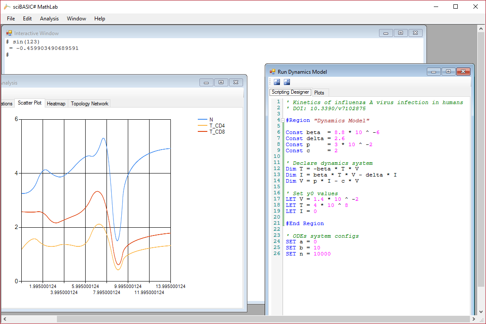

# MathLab
sciBASIC# in winform


## Gallery




## Development Note

This project is based on ``sciBASIC#`` runtime, required of reference to the package from nuget:

```bash
# https://github.com/xieguigang/sciBASIC
# https://www.nuget.org/packages/sciBASIC#

# For install latest stable release version:
PM> Install-Package sciBASIC
```

## Open Source Licenses

+ [sciBASIC#](https://github.com/xieguigang/sciBASIC): Microsoft VisualBasic for Scientific
+ [Console Control](https://www.codeproject.com/Articles/1053951/Console-Control): A Winforms control that looks like a console screen, with full reading and writing support
+ [FastColoredTextBox](https://github.com/PavelTorgashov/FastColoredTextBox): Fast Colored TextBox for Syntax Highlighting. The text editor component for .NET
