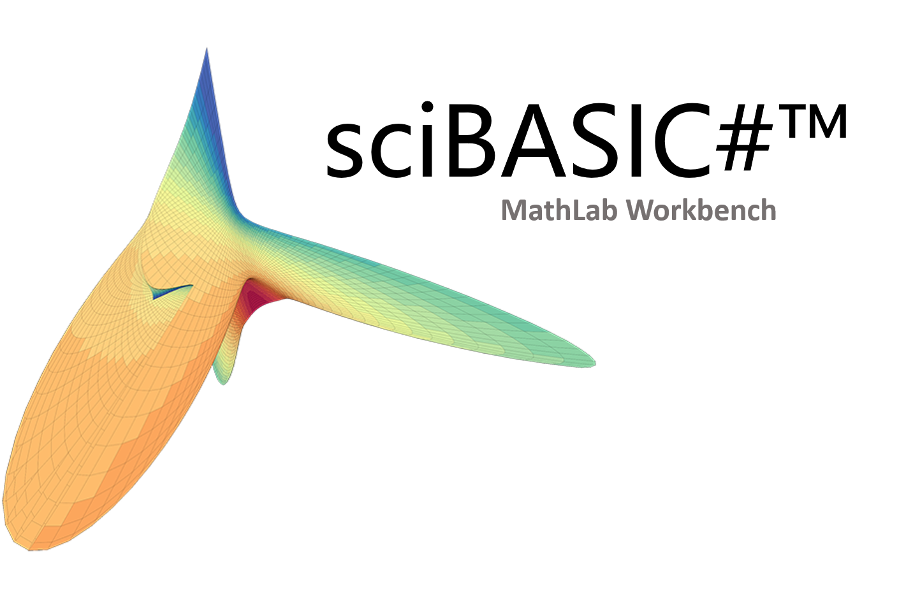

# MathLab
sciBASIC# in winform

##### Open Source Licenses

+ [sciBASIC#](https://github.com/xieguigang/sciBASIC)

  > sciBASIC#: Microsoft VisualBasic for Scientific

+ [Console Control](https://www.codeproject.com/Articles/1053951/Console-Control)

  > A Winforms control that looks like a console screen, with full reading and writing support.

+ [FastColoredTextBox](https://github.com/PavelTorgashov/FastColoredTextBox)

  > Fast Colored TextBox for Syntax Highlighting. The text editor component for .NET.